# 基于Python的南京二手房数据采集及可视化分析
## 1 内容简介
首先通过爬虫采集链家网上所有南京二手房的房源数据，并对采集到的数据进行清洗；然后，对清洗后的数据进行可视化分析，探索隐藏在大量数据背后的规律；最后，采用一个聚类算法对所有二手房数据进行聚类分析，并根据聚类分析的结果，将这些房源大致分类，以对所有数据的概括总结。通过上述分析，我们可以了解到目前市面上二手房各项基本特征及房源分布情况，帮助我们进行购房决策。

## 2 应用技术介绍
1）Python网络爬虫技术
- Requests
- Beautifulsoup

2）Python数据分析技术
- Numpy
- Matplotlib
- Pandas

3）k-means聚类算法

4）高德地图开发者应用JS API

## 3 数据采集及数据清洗

### 3.1 数据采集

该部分通过网络爬虫程序抓取链家网上所有南京二手房的数据，收集原始数据，作为整个数据分析的基石。

3.1.1 链家网网站结构分析

链家网二手房主页界面如图1、图2，主页上面红色方框位置显示目前南京二手房在售房源的各区域位置名称，中间红色方框位置显示了房源的总数量，下面红色方框显示了二手房房源信息缩略图，该红色方框区域包含了二手房房源页面的URL地址标签。图2下面红色方框显示了二手房主页上房源的页数。

链家网二手房主页截图上半部分：

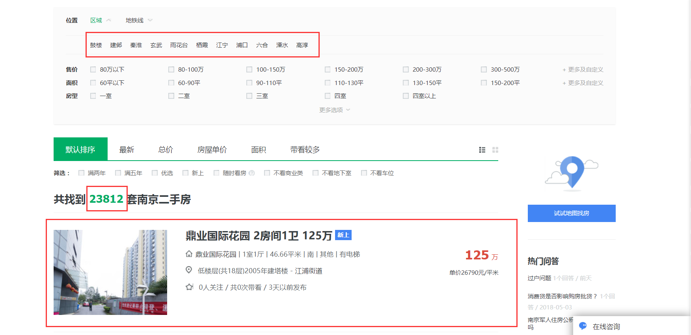

图1 链家网二手房主页

链家网二手房主页截图下半部分：

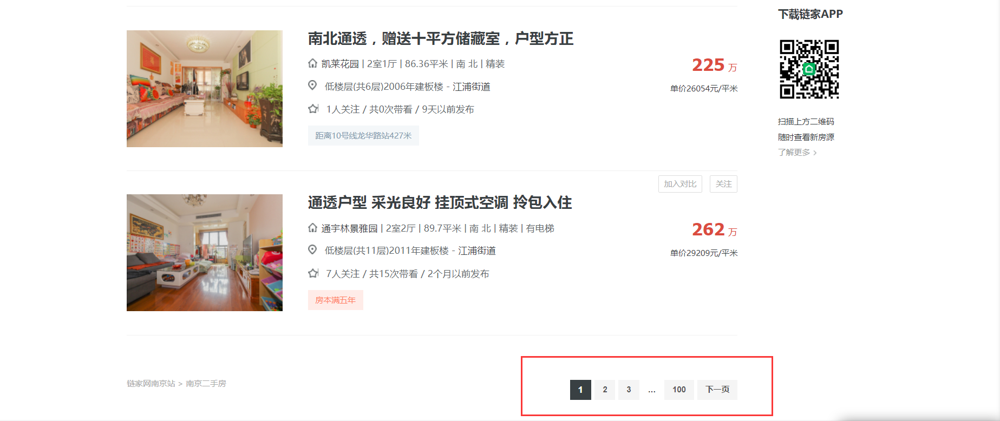

图2 链家网二手房主页

二手房房源信息页面如图3、图4。我们需要采集的目标数据就在该页面，包括基本信息、房屋属性和交易属性三大类。各类信息包括的数据项如下：

1）基本信息：小区名称、所在区域、总价、单价。

2）房屋属性：房屋户型、所在楼层、建筑面积、户型结构、套内面积、建筑类型、房屋朝向、建筑结构、装修情况、梯户比例、配备电梯、产权年限。

3）交易属性：挂牌时间、交易权属、上次交易、房屋用途、房屋年限、产权所属、抵押信息、房本备件。

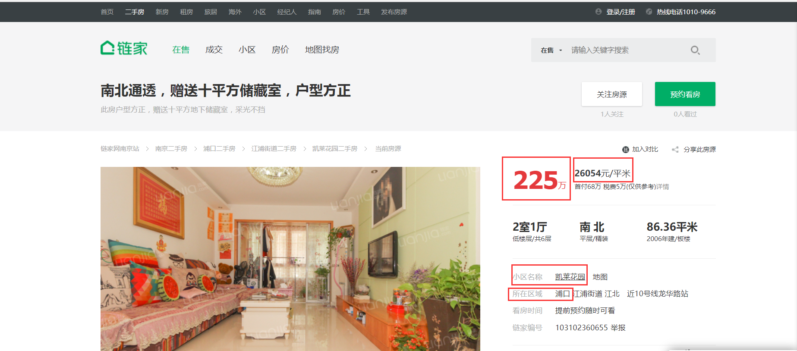

图3 二手房房源信息页面

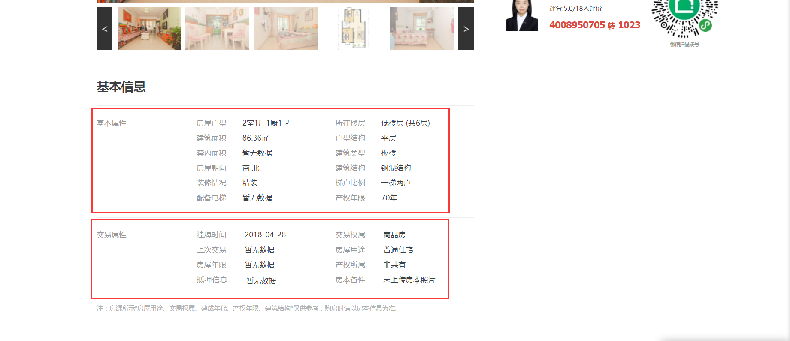

图4 二手房房源信息页面

3.1.3 网络爬虫程序关键问题说明

1）问题1：链家网二手房主页最多只显示100页的房源数据，所以在收集二手房房源信息页面URL地址时会收集不全，导致最后只能采集到部分数据。

解决措施：将所有南京二手房数据分区域地进行爬取，100页最多能够显示3000套房，该区域房源少于3000套时可以直接爬取，如果该区域房源超过3000套可以再分成更小的区域。

2）问题2：爬虫程序如果运行过快，会在采集到两、三千条数据时触发链家网的反爬虫机制，所有的请求会被重定向到链家的人机鉴定页面，从而会导致后面的爬取失败。

解决措施：①为程序中每次http请求构造header并且每次变换http请求header信息头中USER_AGENTS数据项的值，让请求信息看起来像是从不同浏览器发出的访问请求。②爬虫程序每处理完一次http请求和响应后，随机睡眠1-3秒，每请求2500次后，程序睡眠20分钟，控制程序的请求速度。

### 3.2 数据清洗

对于爬虫程序采集得到的数据并不能直接分析，需要先去掉一些“脏”数据，修正一些错误数据，统一所有数据字段的格式，将这些零散的数据规整成统一的结构化数据。

3.2.1 原始数据主要需要清洗的部分

主要需要清洗的数据部分如下：

1）将杂乱的记录的数据项对齐

2）清洗一些数据项格式

3）缺失值处理

3.2.3 数据清洗结果

数据清洗前原始数据如图8，清洗后的数据如图9，可以看出清洗后数据已经规整了许多。

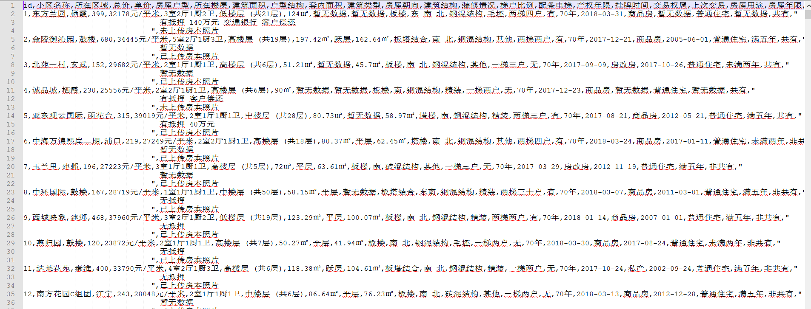

图8 清洗前原始数据截图

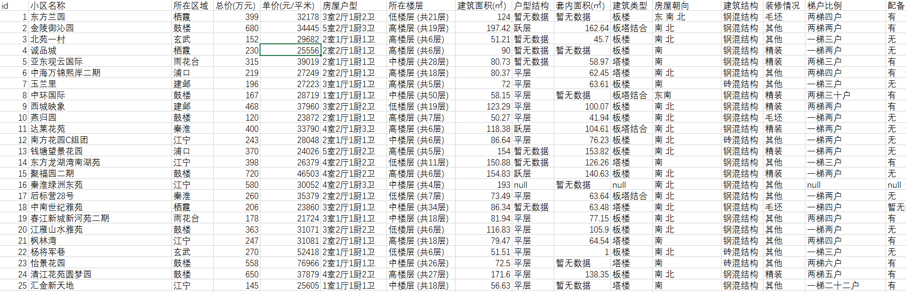

图9 清洗后的数据截图

## 4 数据可视化分析

在数据清洗完成后，我们就可以开始对数据进行可视化分析。该阶段主要是对数据做一个探索性分析并将结果可视化呈现，帮助人们更好、更直观的认识数据，把隐藏在大量数据背后的信息集中和提炼出来。本文主要对二手房房源的总价、单价、面积、户型、地区等属性进行了分析。

数据可视化分析主要步骤如下：1）数据加载；2）数据转换；3）数据可视化呈现。

### 4.1 数据加载

数据分析和建模的大量工作都是用在数据准备上的，如：清理、加载、转换等。清洗完成后的数据仍然存储在文本文件（CSV格式）中，要对数据进行可视化分析，必须先要将数据按一定结果加载到内存中。我们使用Pandas提供的DataFrame对象来加载和处理我们清洗后的数据，Pandas同时提供将表格型数据读取为DataFrame对象的函数。数据加载处理过程中需要注意的主要问题如下：

1）数据项的行列索引的处理；

2）数据类型推断和数据转换；

3）缺失值的处理。

4.2 数据整体质量分析

4.2.1 数据基本情况

数据加载后，数据基本情况如图10。从图中可以看到加载后的数据一共20527行、25列，占用内存3.9+MB。在数据类型上，一共有3列float64类型，2列int64类型，20列object类型。除了户型结构、套内面积、抵押信息三列数据项缺失值比较多之外，其他列数据项的缺失值都不多，所以数据整体的质量还不错。

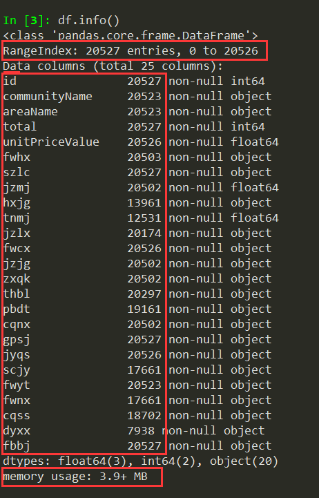

图10 数据基本情况图

4.2.2 整体数据文件词云

从整体数据文件词云（见图11），我们可以得到在南京二手房房源信息中经常出现的高频词，如商品房、普通住宅、一梯两户、钢混结构、精装等。我们可以通过这些高频词，十分粗略的了解整个数据文件中的基本内容。

图11 整体数据文件词云

4.2.3 南京各区域二手房房源数量折线图

南京各区域二手房房源数量折线图（见图13）横轴为南京各个行政区域名称，纵轴为房源数量（套）。从图中可以看出，江宁在售的房源数量最多，高达5000多套，占了总量的1/4。与之相反的是六合区，六合区在售的房源数量仅有1套，数量太少，其他各区的数量相差不多。所以我们后面关于六合区的分析会存在一定误差。

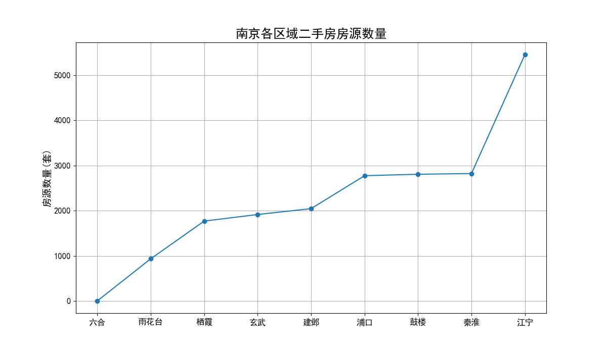

图13 南京各区域二手房房源数量折线图

4.2.4 南京二手房房屋用途水平柱状图

南京二手房房屋用途水平柱状图（见图14）横轴为房源数量（套），纵轴为房屋用途类型。从图中我们可以看出，房屋用途类型有：普通住宅、别墅、商业办公、酒店式公寓、车库5中类型。其中我们主要关心的普通住宅类型的房源数量近20000套，占总量绝大部分。所以在本文中，我们没有剔除掉房屋用途为其他类型的记录，因为这些类型在所有房源样本中占比相当少，不会影响后面的分析结果，同时它们也属于二手房的范畴内。

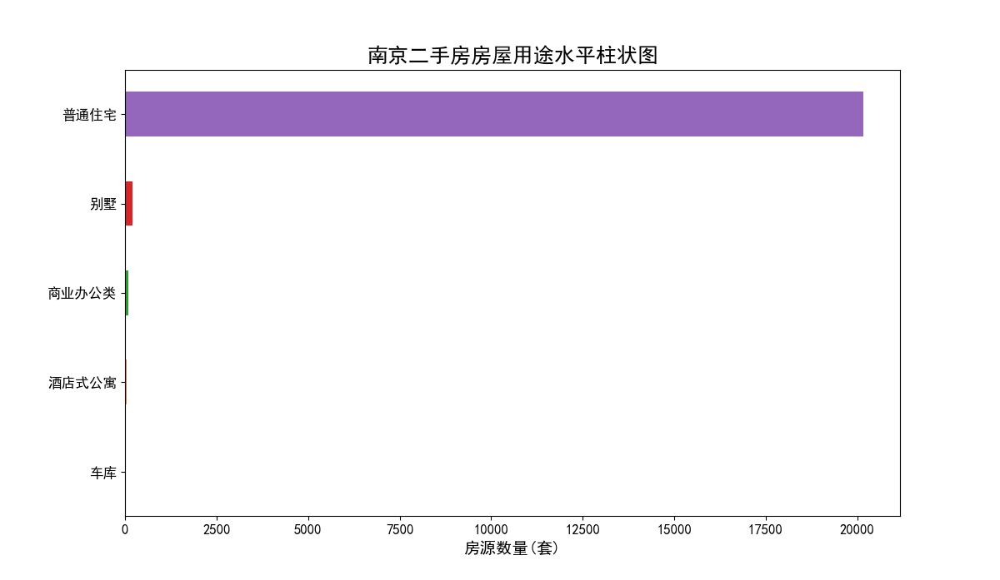

图14 南京二手房房屋用途水平柱状图

4.2.5 数据整体质量总结

通过前面的分析，我们可以看出该数据文件的整体质量还不错。虽然存在一些缺失值比较多的数据项，但我们比较关注一些数据项缺失值不多。这些缺失值较多的都是一些次要的数据项，不影响我们的分析。在房屋用途类型上，数据文件中一共包括了5种类型的二手房房源信息，其中普通住宅类型占比98%以上，所以我们后面分析基本可以看成是针对普通住宅类型的二手房进行的分析，这也符合我们期望。整个数据文件中唯一不足的是六合区域的二手房房源样本点太少，这使我们对六合区域的分析会存在一定的误差。

### 4.3 南京二手房基本信息可视化分析

二手房基本信息可视化分析主要针对二手房：区域、总价、单价、建筑面积四个属性的分析。

4.3.1 南京各区域二手房平均单价柱状图

南京各区域二手房平均单价柱状图（见图15）横轴为南京各区域名称，纵轴为单价（元/平米）。从图中我们可以看到建邺区和鼓楼区二手房平均单价最高，近40000元/平米。建邺区是市中心城区，近几年发展势头很好，房价一路飙升，现在已经成了南京最贵的区域之一。鼓楼区作为南京市的核心地带，拥有众多商场和学区房，其均价一直高升不下。从整体上来看，南京市各个区域（除去存在误差的六合区）均价都已经超过了20000元/平米。这些可以体现出近几年南京市房价猛涨的结果。浦口区虽然相比房价已经很低了，但相较于浦口前几年的房价，差不多是翻了一番。

图15 南京各区域二手房平均单价

4.3.2 南京各区域二手房单价和总价箱线图

南京各区域二手房单价箱线图（见图16）横轴为南京各区域名称，纵轴为单价（元/平米）。二手房平均单价虽然是一个重要参考数据，但平均值不能有效的表示出数据整体上的分布情况，特别是数据中一些离散值的分布情况，这些信息的表现则需要借助箱线图。从图16中可以看出，建邺和鼓楼两个区域房源单价正常值分布都不是太集中，50%的单价分布在30000-50000的区间内，区间跨度比其他区都要大。虽然建邺区平均单价略高于鼓楼区，但鼓楼区的异常值特别多，单价超过50000的房源数不胜数，最高单价有达到100000的，单价上限远高于建邺区，而建邺区异常值相对较少。综合以上情况来看，鼓楼区应该是南京市单价最高的区域。与鼓楼区相邻的玄武区和秦淮区单价正常值分布较为集中50%的数据都分布在30000-40000之间，但这两个异常值也比较多，单价上限也非常高。这些区域单价如此多的异常值，跟这些区域集中的教育和医疗资源有着密不可分的关系。

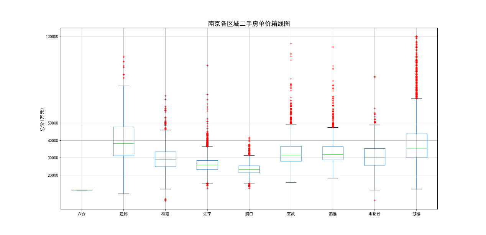

图16 南京各区域二手房单价箱线图

南京各区域二手房总价箱线图（见图17和图18）横轴为南京各区域名称，纵轴为单价（万元）。图18对图17纵轴进行了缩放，更易于观察，其他方面没有区别。从总价这个维度来看，鼓楼、建邺这两个单价最高区域，总价非常的高，500万元的二手房以分布在正常值范围内了。南京其他各区域二手房价格大部分都集中在200-400万元之间，下四分位数十分靠近200万。江宁、栖霞虽然在单价不高，但总价不低，尤其是近几年房价涨幅比较高的江宁，500万以上异常值都已经比较多了。浦口区总价数据分布最为集中，绝大部分数据都200-300万区间内。

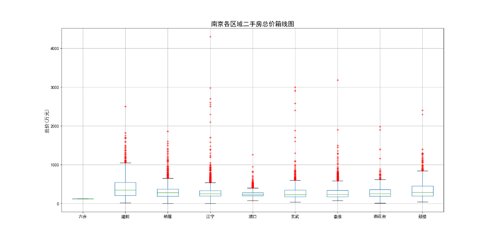

图17 南京各区域二手房总价箱线图

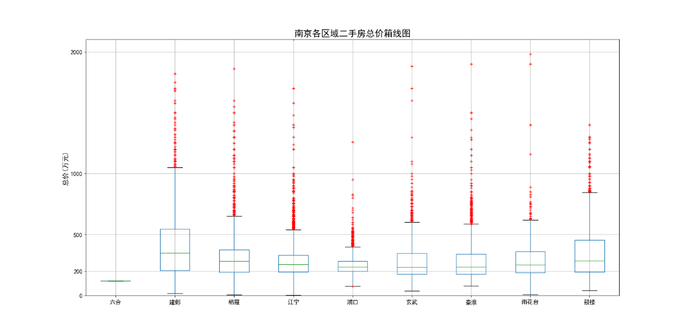

图18 南京各区域二手房总价箱线图

4.3.3 南京二手房单价最高Top20

南京二手房单价最高Top20水平柱状图（见图19）横轴为单价（元/平米），纵轴为小区名字。从图中可以看出，单价前20的房源都已经超过9万，并且都集中在鼓楼区，这也印证了上面箱线图中鼓楼区如此多异常值的存在。

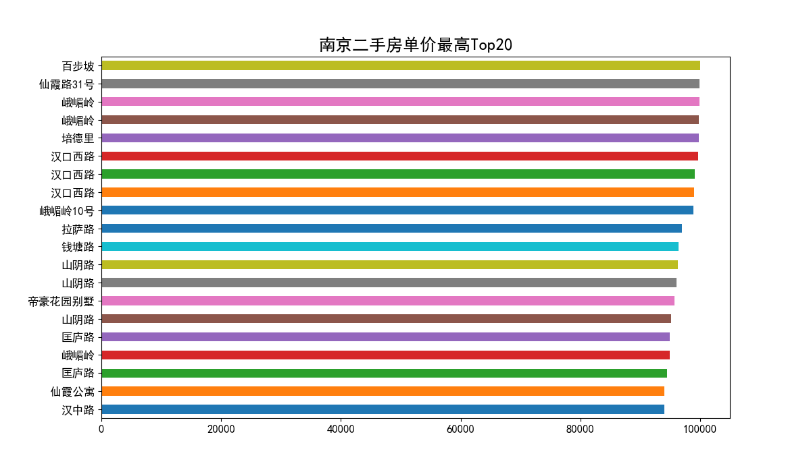

图19 南京二手房单价最高Top20

4.3.4 南京二手房单价和总价热力图

南京二手房单价热力图（见图20）和南京二手房总价热力图（见图21）红色区域代表房源密集度高且房价高的区域。从图中可以看出鼓楼、玄武、秦淮、建邺上半部分是密集度最高的区域。这4个区域处于南京市正中心的位置，交通方便，医疗、教育等资源集中，这些因素一起造就了这些区域高价格。

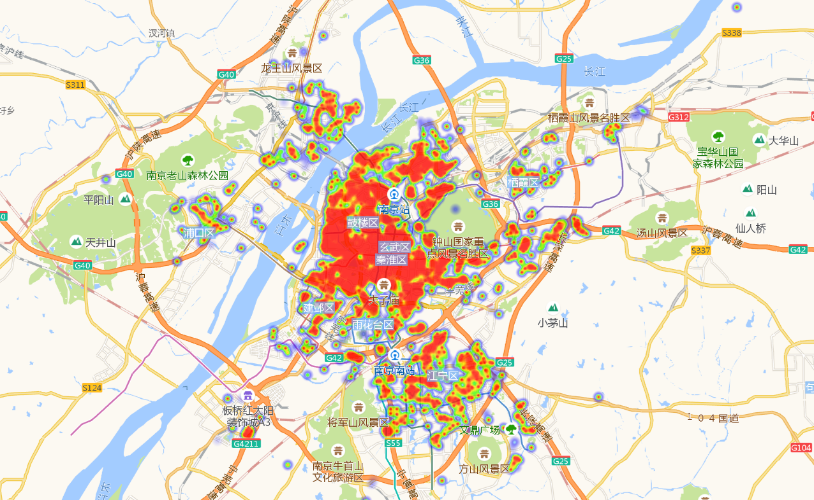

图20 南京二手房单价热力图

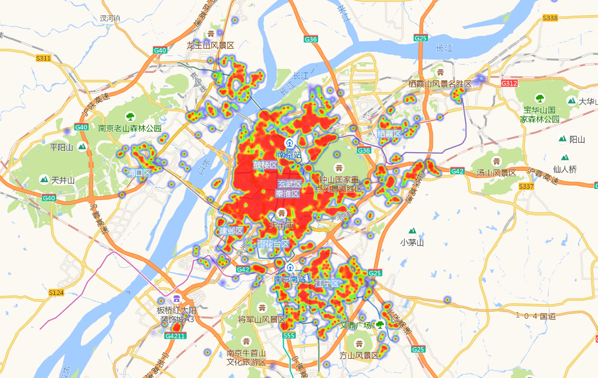

图21 南京二手房总价热力图

4.3.5 南京二手房总价小于200万的分布图

南京二手房总价小于200万的房源一共有6000多套，分布图见图23。从图中我们可以看出，除了鼓楼区和建邺区比较少，其他区域低于200万的房子还是有的。

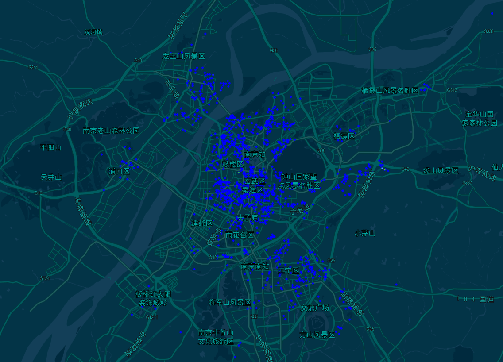

图23 南京二手房总价小于200万的分布图

4.3.6 南京二手房建筑面积分析

南京二手房建筑面积分布区间图（图24）横轴为房源数量（套），纵轴为分布区间（平米）。从图中可以看出在建筑面积50-100区间内房源数量最多，超过了10000套。其次是100-150区间与小于50的区间。

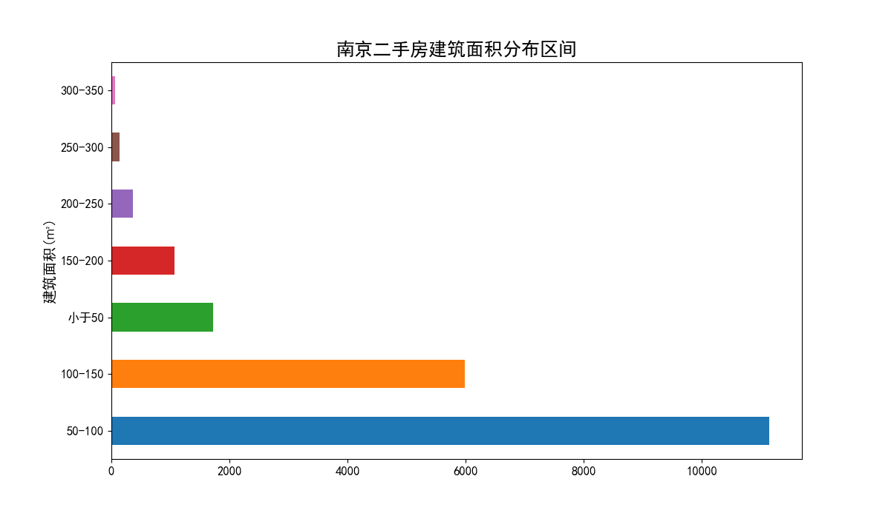

图24 南京二手房建筑面积分布区间柱状图

南京各区域平均建筑面积柱状图（图25）横轴为各区域名字，纵轴为建筑面积（平米）。从图中可以看出玄武、秦淮、鼓楼这几个单价比较高的老城区平均建筑面积最小，平均面积80平米左右。反而是江宁、浦口这两个单价最低的区域平均建筑面积最大，平均面积大小超过了100平米。

图25 南京各区域二手房平均建筑面积柱状图

4.3.7 南京二手房单价、总价与建筑面积散点图

南京二手房总价与建筑面积散点图（图26）横轴为建筑面积（平米），纵轴为总价（万元）。从图中可以看出，总价与建筑面积这两个变量符合正相关关系。数据点分布比较集中，大多数都在总价0-1500万元与建筑面积0-400平米这个区域内。

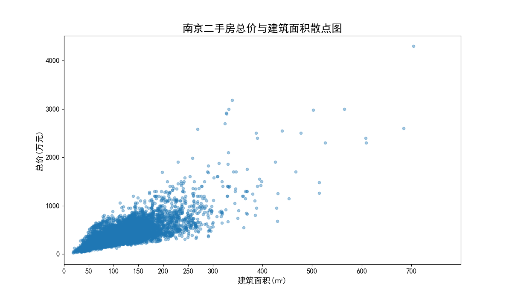

图26 南京二手房总价与建筑面积散点图

南京二手房单价与建筑面积散点图（图27）横轴为建筑面积（平米），纵轴为单价（元/平米）。从图中可以看出建筑面积与单价并无明显关系，同样样本点分布也较为集中，离散值不多，但单价特别高的房源，建筑面积都不是太大，可能因为这些房源一般都位于市中心。

图27 南京二手房单价与建筑面积散点图

### 4.4 南京二手房房屋属性可视化分析

4.4.1 南京二手房房屋户型占比情况

从南京二手房房屋户型饼状图（图28）中可以看出，2室1厅与2室2厅作为标准配置，一共占比接近一半。其中3室2厅和3室1厅的房源也占比不少，其他房屋户型的房源占比就比较少了。

图28 南京二手房房屋户型饼状图

4.4.2 南京二手房房屋装修情况

从南京二手房房屋装修情况饼状图（图29）可以看出，近60%的房源的房屋装修情况都是其他，可能因为房源全部为二手房的缘故，大家都自主装修过的。

图29 南京二手房装修情况饼状图

4.4.3 南京二手房房屋朝向分布情况

南京二手房房屋朝向柱状图（图30）横轴为房屋朝向，纵轴为房源数量（套）。从图中我们可以看出，只有少数几种的朝向比较多，其余的都非常少，明显属于长尾分布类型（严重偏态）。这也符合我们的认识，房屋朝向一半以上都是坐北朝南的。

图30 南京二手房房屋朝向分布柱状图

4.4.4 南京二手房建筑类型占比情况

从南京二手房建筑类型饼状图（图31）中，我们可以看出房源的建筑类型65.6%都是板楼，现在房地产商喜欢开发的塔楼反而较少，这和南京二手房建筑时间都比较久远相符。

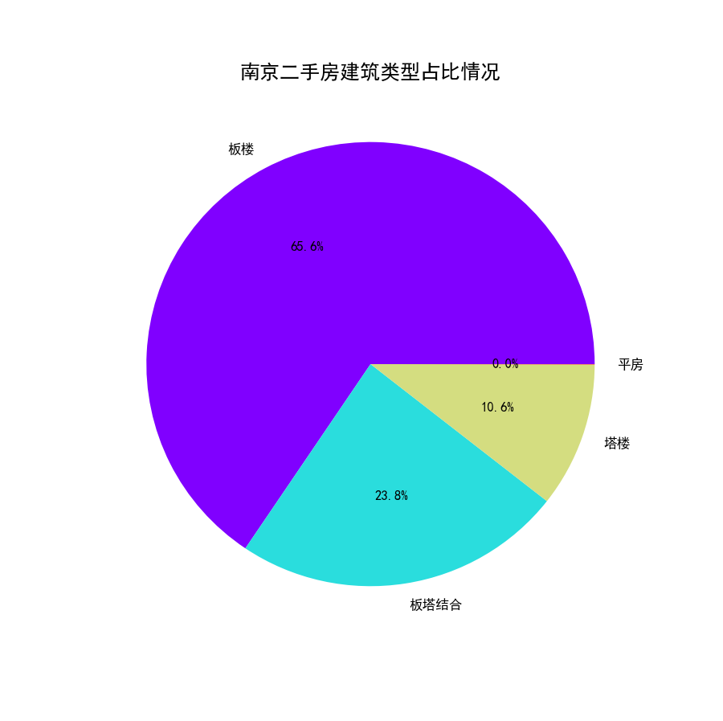

图31 南京二手房建筑类型饼状图

## 5 数据聚类分析

该阶段采用聚类算法中的k-means算法对所有二手房数据进行聚类分析，根据聚类的结果和经验，将这些房源大致分类，已达到对数据概括总结的目的。在聚类过程中，我们选择了面积、总价和单价这三个数值型变量作为样本点的聚类属性。

### 5.1 k-means算法原理

5.1.1 基本原理

k-Means算法是一种使用最普遍的聚类算法，它是一种无监督学习算法，目的是将相似的对象归到同一个簇中。簇内的对象越相似，聚类的效果就越好。该算法不适合处理离散型属性，但对于连续型属性具有较好的聚类效果。

5.1.2 聚类效果判定标准

使各个样本点与所在簇的质心的误差平方和达到最小，这是评价k-means算法最后聚类效果的评价标准。

5.1.3 算法实现步骤

1）选定k值

2）创建k个点作为k个簇的起始质心。

3）分别计算剩下的元素到k个簇的质心的距离，将这些元素分别划归到距离最小的簇。

4）根据聚类结果，重新计算k个簇各自的新的质心，即取簇中全部元素各自维度下的算术平均值。

5）将全部元素按照新的质心重新聚类。

6）重复第5步，直到聚类结果不再变化。

7）最后，输出聚类结果。

5.1.4 算法缺点

虽然K-Means算法原理简单，但是有自身的缺陷：

1）聚类的簇数k值需在聚类前给出，但在很多时候中k值的选定是十分难以估计的，很多情况我们聚类前并不清楚给出的数据集应当分成多少类才最恰当。

2）k-means需要人为地确定初始质心，不一样的初始质心可能会得出差别很大的聚类结果，无法保证k-means算法收敛于全局最优解。

3）对离群点敏感。

4）结果不稳定（受输入顺序影响）。

5）时间复杂度高O(nkt)，其中n是对象总数，k是簇数，t是迭代次数。

### 5.2 算法实现关键问题说明

5.2.1 K值的选定说明

根据聚类原则：组内差距要小，组间差距要大。我们先算出不同k值下各个SSE(Sum of
squared
errors)值，然后绘制出折线图（图32）来比较，从中选定最优解。从图中，我们可以看出k值到达5以后，SSE变化趋于平缓，所以我们选定5作为k值。

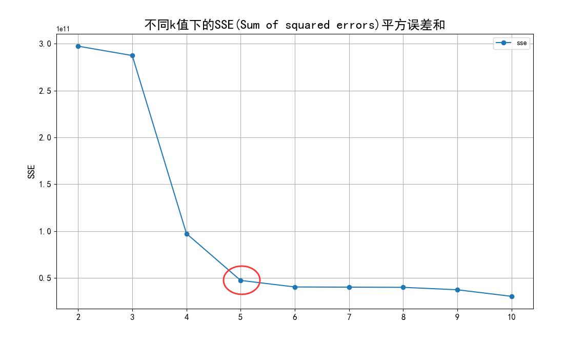

图32 不同k值下SSE值折线图

5.2.2 初始的K个质心选定说明

初始的k个质心选定是采用的随机法。从各列数值最大值和最小值中间按正太分布随机选取k个质心。5.2.3
关于离群点

离群点就是远离整体的，非常异常、非常特殊的数据点。因为k-means算法对离群点十分敏感，所以在聚类之前应该将这些“极大”、“极小”之类的离群数据都去掉，否则会对于聚类的结果有影响。离群点的判定标准是根据前面数据可视化分析过程的散点图和箱线图进行判定。根据散点图和箱线图，需要去除离散值的范围如下：

1）单价：基本都在100000以内，没有特别的异常值。

2）总价：基本都集中在3000以内，这里我们需要去除3000外的异常值。

3）建筑面积：基本都集中在500以内，这里我们需要去除500外的异常值。

5.2.4 数据的标准化

因为总价的单位为万元，单价的单位为元/平米，建筑面积的单位为平米，所以数据点计算出欧几里德距离的单位是没有意义的。同时，总价都是3000以内的数，建筑面积都是500以内的数，但单价基本都是20000以上的数，在计算距离时单价起到的作用就比总价大，总价和单价的作用都远大于建筑面积，这样聚类出来的结果是有问题的。这样的情况下，我们需要将数据标准化，即将数据按比例缩放，使之都落入一个特定区间内。去除数据的单位限制，将其转化为无量纲的纯数值，便于不同单位或量级的指标能够进行计算和比较。

我们将单价、总价和面积都映射到500，因为面积本身就都在500以内，不要特别处理。单价在计算距离时，需要先乘以映射比例0.005，总价需要乘以映射比例0.16。进行数据标准化前和进行数据标准化后的聚类效果对比如下：图32、图33是没有数据标准化前的聚类效果散点图；图34、图35是数据标准化后的聚类效果散点图。

数据标准化前的单价与建筑面积聚类效果散点图：

图32 数据标准化前的单价与建筑面积散点图

数据标准化前总价与建筑面积聚类效果散点图。

图33 数据标准化前总价与建筑面积散点图

数据标准化后单价与建筑面积聚类效果散点图。

图34 数据标准化后单价与建筑面积散点图

数据标准化后总价与建筑面积聚类效果散点图。

图35 数据标准化后总价与建筑面积散点图

### 5.3 聚类结果分析

聚类结果如下

1）聚类结果统计信息如下：

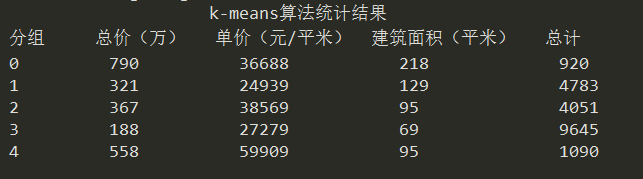

2）聚类后的单价与建筑面积散点图和总价与建筑面积散点图见图34、图35。

3）聚类结果分组0、1、2、3、4的区域分布图分别如下：图36、图37、图38、图39、图40。

聚类结果分组0的区域分布图如下：

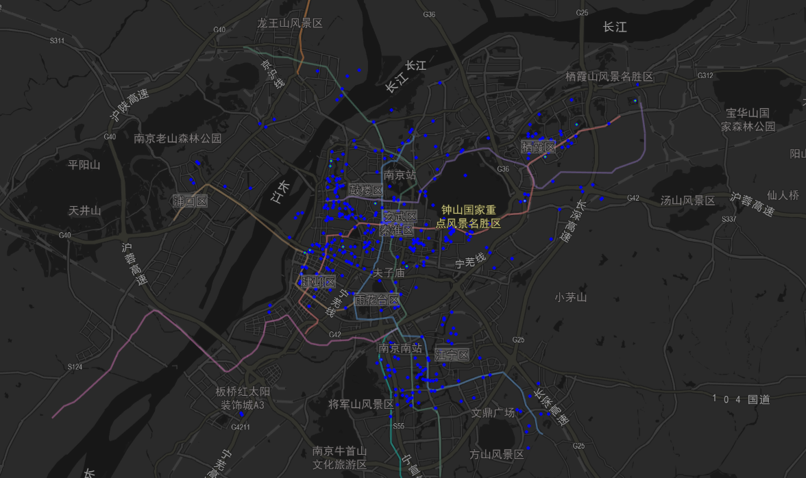

图36 聚类结果0区域分布图

聚类结果分组1的区域分布图如下：

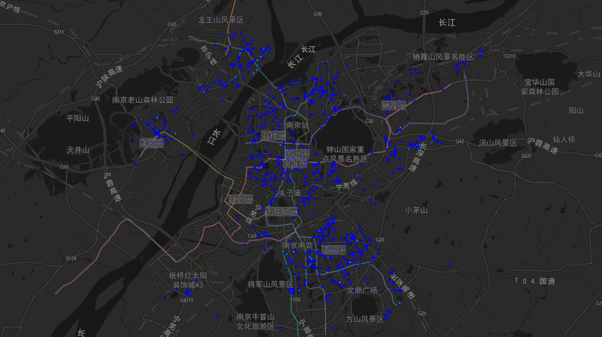

图37 聚类结果1区域分布图

聚类结果分组2的区域分布图如下：

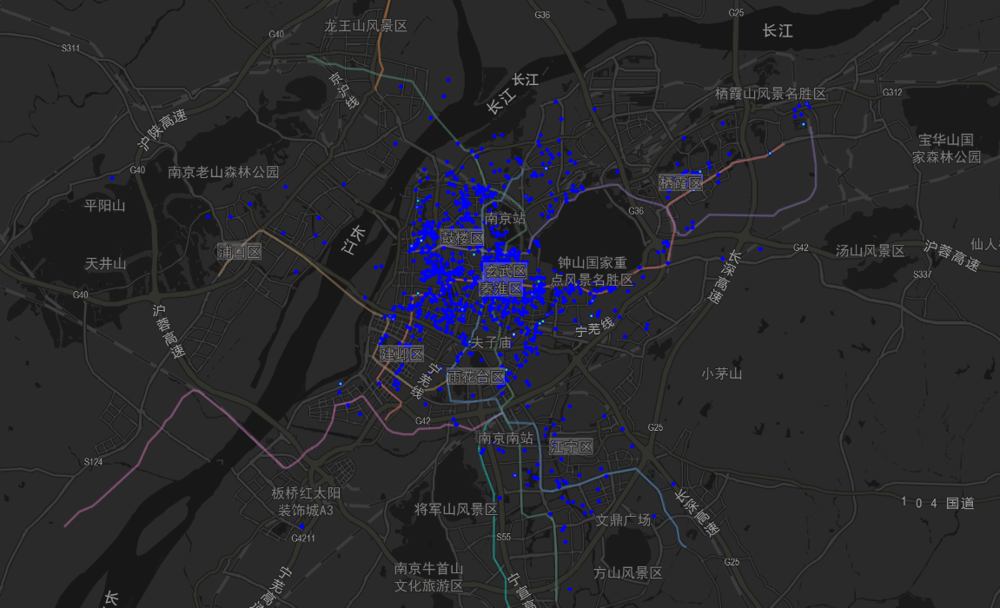

图38 聚类结果2区域分布图

聚类结果分组3的区域分布图如下：

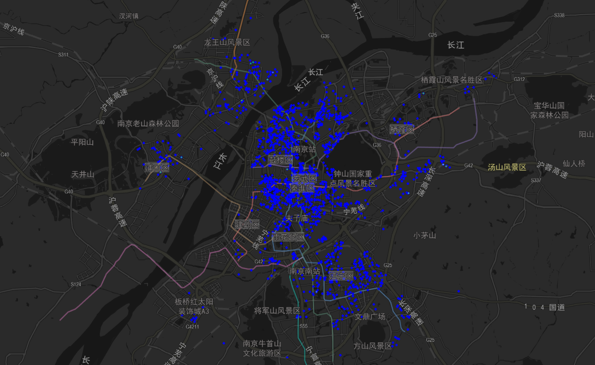

图39 聚类结果3区域分布图

聚类结果分组4的区域分布图如下：

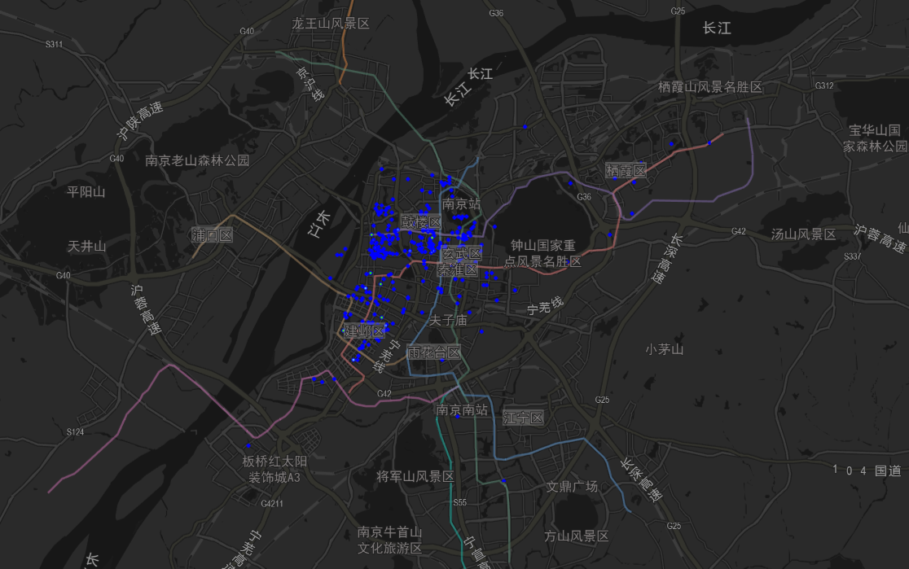

图40 聚类结果4区域分布图

根据以上聚类结果和我们的经验分析，我们大致可以将这20000多套房源分为以下4类：

a、大户型（面积大，总价高），属于第0类。平均面积都在200平以上，这种大户型的房源相对数量较少，主要分布在鼓楼、建邺、江宁、栖霞等地（具体可从各类中的区域分布图可知）。

b、地段型（单价高），属于第2、4类。这种房源围绕南京市中心位置集中分布，地理位置极好，交通方便，主要分布鼓楼、玄武、建邺、建邺等地（具体可从各类中的区域分布图可知）。

c、大众蜗居型（面积小、价格相对较低、房源多），属于第3类。这类房源分布范围广，主要围绕在各地铁线两边。典型的区域有秦淮、鼓楼、江宁、玄武、浦口等地。

d、高性价比型（面积相对大，单价低），属于第1类。典型的区域有栖霞、浦口、江宁等地。
